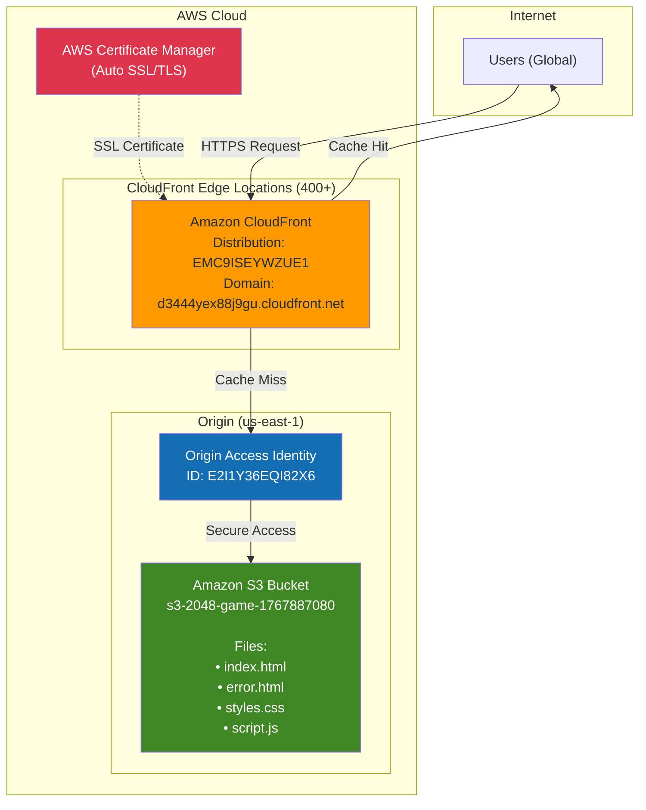
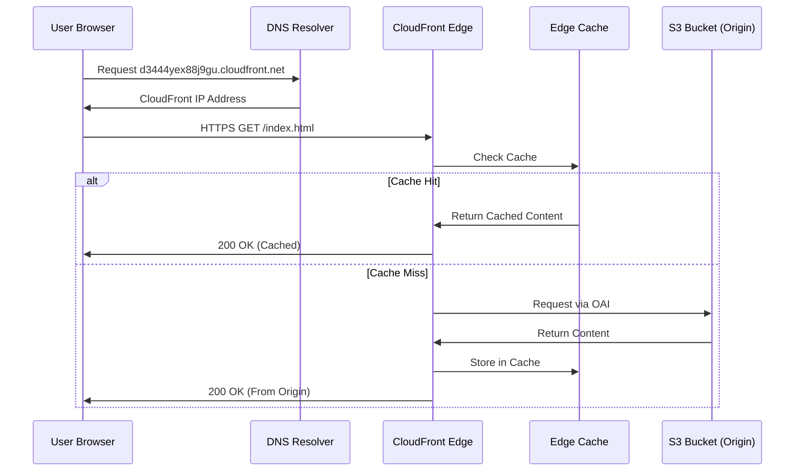
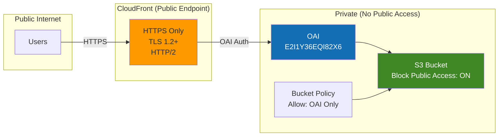

# Create a Static Website and Host it with S3

> **Hands-on Lab: Deploy a 2048 Game on AWS S3 with CloudFront CDN and OAI**

---

## Architecture Overview

### Mermaid Architecture Diagram



### Data Flow Diagram



### Security Architecture



---

## AWS Components Deployed

### Complete Resource Inventory

| Component | Resource ID/Name | Region | Purpose |
|-----------|------------------|--------|---------|
| **S3 Bucket** | `s3-2048-game-1767887080` | us-east-1 | Static file storage |
| **CloudFront Distribution** | `EMC9ISEYWZUE1` | Global | CDN delivery |
| **CloudFront Domain** | `d3444yex88j9gu.cloudfront.net` | Global | Public endpoint |
| **Origin Access Identity** | `E2I1Y36EQI82X6` | Global | Secure S3 access |
| **SSL Certificate** | Auto-provisioned | us-east-1 | HTTPS encryption |

### S3 Bucket Contents

| File | Size | Content Type | Purpose |
|------|------|--------------|---------|
| `index.html` | 9,479 bytes | text/html | 2048 Game main page |
| `error.html` | 1,567 bytes | text/html | Custom 404 error page |
| `styles.css` | 7,344 bytes | text/css | Game styling |
| `script.js` | 11,040 bytes | application/javascript | Game logic |
| **Total** | **29,430 bytes** | - | ~29 KB |

---

## AWS Pricing Breakdown

### Detailed Cost Analysis

#### Amazon S3 Pricing (us-east-1)

| Pricing Component | Rate | This Deployment | Monthly Cost |
|-------------------|------|-----------------|--------------|
| **Storage** (Standard) | $0.023/GB | 0.00003 GB (29 KB) | $0.000001 |
| **PUT Requests** | $0.005/1,000 | 4 initial uploads | $0.00002 |
| **GET Requests** | $0.0004/1,000 | ~1,000/month | $0.0004 |
| **Data Transfer Out** | $0.00/GB | Via CloudFront | $0.00 |
| **S3 Subtotal** | - | - | **~$0.001** |

#### Amazon CloudFront Pricing

| Pricing Component | Rate | This Deployment | Monthly Cost |
|-------------------|------|-----------------|--------------|
| **Data Transfer Out** (First 10TB) | $0.085/GB | ~0.1 GB/month | $0.0085 |
| **HTTPS Requests** (First 10M) | $0.0100/10,000 | ~10,000/month | $0.01 |
| **Origin Shield** | Not enabled | - | $0.00 |
| **CloudFront Subtotal** | - | - | **~$0.02** |

#### Origin Access Identity

| Component | Cost |
|-----------|------|
| OAI Creation | **FREE** |
| OAI Usage | **FREE** |

#### AWS Certificate Manager

| Component | Cost |
|-----------|------|
| Public SSL Certificate | **FREE** (with CloudFront) |
| Certificate Renewal | **FREE** (automatic) |

### Total Monthly Cost Summary

| Service | Monthly Cost |
|---------|--------------|
| Amazon S3 | ~$0.001 |
| Amazon CloudFront | ~$0.02 |
| Origin Access Identity | $0.00 |
| AWS Certificate Manager | $0.00 |
| **TOTAL** | **~$0.02 - $0.05/month** |

> **Note**: Costs may vary based on traffic. AWS Free Tier includes 50 GB CloudFront data transfer and 2,000,000 requests per month for the first 12 months.

---

## AWS Best Practices Implemented

### Security Best Practices

| Best Practice | Implementation | AWS Well-Architected Pillar |
|---------------|----------------|------------------------------|
| **Block Public Access** | S3 bucket has all public access blocked | Security |
| **Origin Access Identity** | CloudFront accesses S3 via OAI only | Security |
| **HTTPS Enforcement** | HTTP automatically redirects to HTTPS | Security |
| **TLS 1.2+** | Modern encryption protocols only | Security |
| **Least Privilege** | Bucket policy allows only OAI principal | Security |
| **No S3 Website Hosting** | Static hosting disabled, CloudFront serves content | Security |

### Performance Best Practices

| Best Practice | Implementation | AWS Well-Architected Pillar |
|---------------|----------------|------------------------------|
| **Edge Caching** | 24-hour default TTL at 400+ edge locations | Performance Efficiency |
| **HTTP/2** | Enabled for multiplexed connections | Performance Efficiency |
| **Gzip Compression** | Automatic compression for text files | Performance Efficiency |
| **Regional Origin** | S3 bucket in us-east-1 (optimal for CloudFront) | Performance Efficiency |

### Cost Optimization Best Practices

| Best Practice | Implementation | AWS Well-Architected Pillar |
|---------------|----------------|------------------------------|
| **PriceClass_100** | Use edge locations in NA and Europe only | Cost Optimization |
| **Cache Optimization** | Long TTLs reduce origin requests | Cost Optimization |
| **S3 Standard** | Appropriate for frequently accessed content | Cost Optimization |
| **No Idle Resources** | Serverless architecture, pay only for usage | Cost Optimization |

### Reliability Best Practices

| Best Practice | Implementation | AWS Well-Architected Pillar |
|---------------|----------------|------------------------------|
| **Multi-AZ S3** | S3 automatically stores data across 3+ AZs | Reliability |
| **CloudFront Redundancy** | Automatic failover between edge locations | Reliability |
| **Custom Error Pages** | 404 errors return custom error.html | Reliability |
| **11 9s Durability** | S3 provides 99.999999999% durability | Reliability |

### Operational Excellence Best Practices

| Best Practice | Implementation | AWS Well-Architected Pillar |
|---------------|----------------|------------------------------|
| **Infrastructure as Code** | Deployment via AWS CLI scripts | Operational Excellence |
| **Versioning Ready** | Can enable S3 versioning for rollback | Operational Excellence |
| **Logging Available** | Can enable CloudFront/S3 access logs | Operational Excellence |

---

## Architecture Diagram (ASCII)

```
┌─────────────────────────────────────────────────────────────────────────────────┐
│                        AWS S3 Static Website Architecture                        │
│                                                                                  │
│  Website URL: https://d3444yex88j9gu.cloudfront.net                             │
└─────────────────────────────────────────────────────────────────────────────────┘

                                    ┌─────────────┐
                                    │   Users     │
                                    │  (Global)   │
                                    └──────┬──────┘
                                           │
                                           │ HTTPS Request
                                           ▼
┌─────────────────────────────────────────────────────────────────────────────────┐
│                           Amazon CloudFront (CDN)                                │
│  ┌─────────────────────────────────────────────────────────────────────────┐   │
│  │  Distribution ID: EMC9ISEYWZUE1                                          │   │
│  │  Domain: d3444yex88j9gu.cloudfront.net                                  │   │
│  │                                                                          │   │
│  │  Configuration:                                                          │   │
│  │  • Price Class: PriceClass_100 (NA + Europe)                            │   │
│  │  • HTTPS: Redirect HTTP to HTTPS                                        │   │
│  │  • HTTP/2: Enabled                                                      │   │
│  │  • Compression: Enabled                                                 │   │
│  │  • Default TTL: 86400 seconds (24 hours)                                │   │
│  │  • Custom Error: 404 → /error.html                                      │   │
│  │  • Default Root Object: index.html                                      │   │
│  └─────────────────────────────────────────────────────────────────────────┘   │
└─────────────────────────────────────────────────────────────────────────────────┘
                                          │
                                          │ Origin Access Identity (OAI)
                                          │ ID: E2I1Y36EQI82X6
                                          ▼
┌─────────────────────────────────────────────────────────────────────────────────┐
│                              Amazon S3 Bucket                                    │
│  ┌─────────────────────────────────────────────────────────────────────────┐   │
│  │  Bucket: s3-2048-game-1767887080                                        │   │
│  │  Region: us-east-1                                                      │   │
│  │                                                                          │   │
│  │  Security:                                                               │   │
│  │  ✓ BlockPublicAcls: true                                                │   │
│  │  ✓ IgnorePublicAcls: true                                               │   │
│  │  ✓ BlockPublicPolicy: true                                              │   │
│  │  ✓ RestrictPublicBuckets: true                                          │   │
│  │                                                                          │   │
│  │  Bucket Policy: Allow s3:GetObject for OAI CanonicalUser only           │   │
│  │                                                                          │   │
│  │  Contents (29 KB total):                                                │   │
│  │  ├── index.html      (9.5 KB)  - 2048 Game                              │   │
│  │  ├── error.html      (1.5 KB)  - Custom 404                             │   │
│  │  ├── styles.css      (7.3 KB)  - Styling                                │   │
│  │  └── script.js       (11 KB)   - Game logic                             │   │
│  └─────────────────────────────────────────────────────────────────────────┘   │
└─────────────────────────────────────────────────────────────────────────────────┘
```

---

## Step-by-Step Deployment Guide

### Prerequisites

- AWS CLI configured with appropriate permissions
- `jq` installed for JSON parsing
- Basic understanding of S3 and CloudFront

### Step 1: Create S3 Bucket

```bash
# Set variables
export BUCKET_NAME="s3-static-website-$(date +%s)"
export REGION="us-east-1"

# Create bucket
aws s3api create-bucket \
    --bucket "$BUCKET_NAME" \
    --region "$REGION"
```

### Step 2: Block Public Access

```bash
# Block ALL public access - CloudFront OAI will provide access
aws s3api put-public-access-block \
    --bucket "$BUCKET_NAME" \
    --public-access-block-configuration \
    "BlockPublicAcls=true,IgnorePublicAcls=true,BlockPublicPolicy=true,RestrictPublicBuckets=true"
```

### Step 3: Create CloudFront Origin Access Identity (OAI)

```bash
# Create OAI
OAI_RESULT=$(aws cloudfront create-cloud-front-origin-access-identity \
    --cloud-front-origin-access-identity-config \
    "CallerReference=$(date +%s),Comment=OAI for $BUCKET_NAME")

# Extract OAI details
OAI_ID=$(echo "$OAI_RESULT" | jq -r '.CloudFrontOriginAccessIdentity.Id')
OAI_CANONICAL_USER=$(echo "$OAI_RESULT" | jq -r '.CloudFrontOriginAccessIdentity.S3CanonicalUserId')
```

### Step 4: Configure Bucket Policy for OAI

```bash
# Create bucket policy allowing only CloudFront OAI
cat > bucket-policy.json << EOF
{
    "Version": "2012-10-17",
    "Statement": [
        {
            "Sid": "AllowCloudFrontOAI",
            "Effect": "Allow",
            "Principal": {
                "CanonicalUser": "$OAI_CANONICAL_USER"
            },
            "Action": "s3:GetObject",
            "Resource": "arn:aws:s3:::$BUCKET_NAME/*"
        }
    ]
}
EOF

aws s3api put-bucket-policy --bucket "$BUCKET_NAME" --policy file://bucket-policy.json
```

### Step 5: Upload Website Files

```bash
# Upload all website files
aws s3 sync ./website/ "s3://$BUCKET_NAME/"

# Set correct content types
aws s3 cp "s3://$BUCKET_NAME/index.html" "s3://$BUCKET_NAME/index.html" \
    --content-type "text/html" --metadata-directive REPLACE
```

### Step 6: Create CloudFront Distribution

```bash
# Create distribution (see deploy.sh for full config)
aws cloudfront create-distribution --distribution-config file://cloudfront-config.json
```

---

## Console Configuration (Alternative)

### S3 Console
1. Create bucket → Block all public access ✓
2. Upload files (index.html, error.html, styles.css, script.js)

### CloudFront Console
1. Create OAI: CloudFront → Origin access → Create
2. Create Distribution:
   - Origin: Select S3 bucket
   - Origin access: Use OAI
   - Viewer protocol: Redirect HTTP to HTTPS
   - Default root object: index.html
3. Wait 10-15 minutes for deployment

---

## Cleanup Commands

```bash
# 1. Disable CloudFront distribution
aws cloudfront get-distribution-config --id EMC9ISEYWZUE1 --query 'ETag' --output text
# Save ETag, then disable and delete

# 2. Empty S3 bucket
aws s3 rm s3://s3-2048-game-1767887080 --recursive

# 3. Delete S3 bucket
aws s3api delete-bucket --bucket s3-2048-game-1767887080

# 4. Delete OAI
aws cloudfront delete-cloud-front-origin-access-identity --id E2I1Y36EQI82X6 --if-match ETAG
```

---

## Learning Outcomes

- ✅ S3 bucket configuration for static content
- ✅ CloudFront CDN setup and configuration
- ✅ Origin Access Identity (OAI) security pattern
- ✅ HTTPS/TLS encryption with ACM
- ✅ AWS Well-Architected best practices
- ✅ Cost optimization for serverless hosting

---

**Lab Status:** Documentation Complete | Infrastructure: Terminated
**Last Updated:** January 2026
