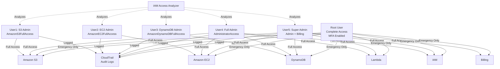

# Architecture Diagram

## Overview
AWS Identity and Access Management (IAM) with 5 users demonstrating the Principle of Least Privilege.

## Architecture



## Permission Matrix

| Service | user1 | user2 | user3 | user4 | user5 | Root |
|---------|:-----:|:-----:|:-----:|:-----:|:-----:|:----:|
| S3 | ✅ | ❌ | ❌ | ✅ | ✅ | ✅ |
| EC2 | ❌ | ✅ | ❌ | ✅ | ✅ | ✅ |
| DynamoDB | ❌ | ❌ | ✅ | ✅ | ✅ | ✅ |
| Lambda | ❌ | ❌ | ❌ | ✅ | ✅ | ✅ |
| IAM | ❌ | ❌ | ❌ | ✅ | ✅ | ✅ |
| Billing | ❌ | ❌ | ❌ | ❌ | ✅ | ✅ |

## Key Concepts

### Principle of Least Privilege
Each user has ONLY the minimum permissions needed for their role:
- **user1**: S3 operations only
- **user2**: EC2 operations only
- **user3**: DynamoDB operations only
- **user4**: Full AWS access (no billing)
- **user5**: Full AWS access + billing

### Security Best Practices
- ✅ No access keys created
- ✅ Least privilege permissions
- ✅ CloudTrail logging enabled
- ✅ IAM Access Analyzer for policy review
- ✅ Root user reserved for emergencies

## Deployment

```bash
# Deploy with Terraform
cd terraform
terraform init
terraform apply

# Or deploy with AWS CLI
./deploy.sh
```

## Cost
**FREE** - IAM has no charges

## Duration
**20 minutes**
