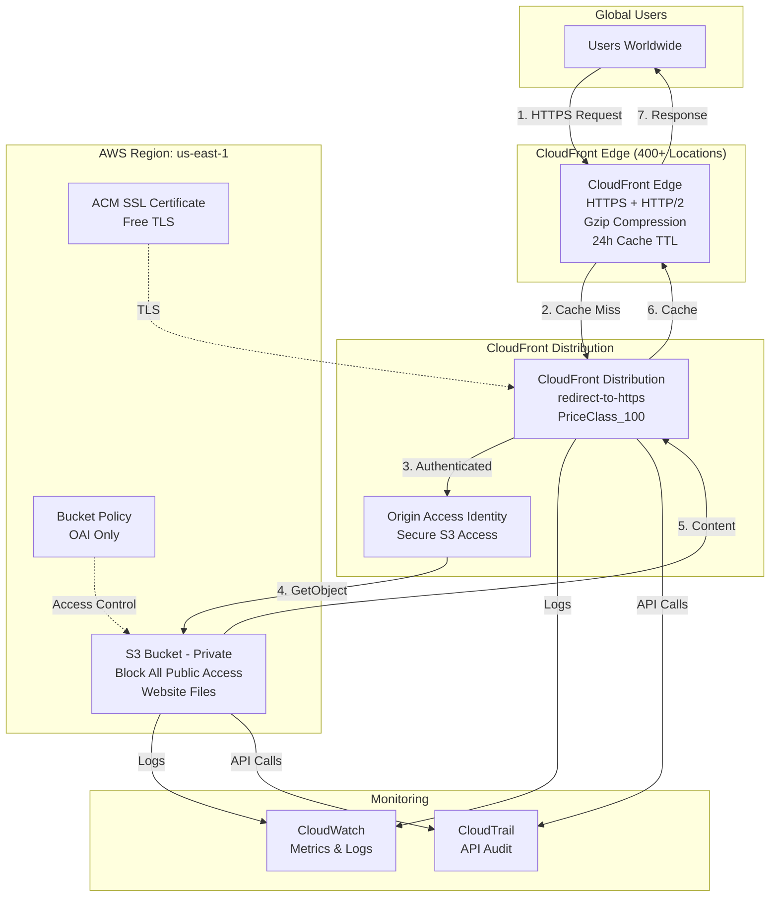

# Architecture Diagram

## Overview
Serverless static website hosting with global CDN delivery and Origin Access Identity security.

## Architecture



## Request Flow

```
User → CloudFront Edge → [Cache Hit?] → Return Cached Content
                              ↓ No
                         OAI Auth → S3 Bucket → Cache & Return
```

## Key Components

### S3 Bucket
- Private bucket (all public access blocked)
- Stores static website files (HTML, CSS, JS)
- Bucket policy allows OAI access only

### CloudFront Distribution
- Global CDN with 400+ edge locations
- HTTPS enforcement (redirect-to-https)
- HTTP/2 and Gzip compression enabled
- 24-hour cache TTL

### Origin Access Identity (OAI)
- Secure bridge between CloudFront and S3
- Prevents direct S3 access
- CloudFront authenticates using OAI

### Security Features
- ✅ Private S3 bucket (no public access)
- ✅ OAI authentication
- ✅ HTTPS enforcement
- ✅ CloudTrail audit logging
- ✅ CloudWatch monitoring

## Deployment

```bash
# Quick deploy
./deploy.sh

# Manual deployment
aws s3api create-bucket --bucket my-site-$(date +%s)
aws s3api put-public-access-block --bucket my-site --public-access-block-configuration "BlockPublicAcls=true,IgnorePublicAcls=true,BlockPublicPolicy=true,RestrictPublicBuckets=true"
# ... (see README for full steps)
```

## Cost Breakdown

| Traffic Level | Monthly Cost |
|---------------|--------------|
| Low (1K visits) | ~$0.02 |
| Medium (10K visits) | ~$0.20 |
| High (100K visits) | ~$2.00 |

### Cost Components
- S3 Storage: $0.023/GB
- S3 Requests: $0.0004/1K GET requests
- CloudFront Transfer: $0.085/GB (first 10TB)
- CloudFront Requests: $0.01/10K HTTPS requests
- OAI: FREE
- ACM Certificate: FREE

## Performance

- **Latency**: 10-50ms (edge location)
- **Cache Hit Ratio**: >90% target
- **Global Coverage**: 400+ edge locations
- **HTTP/2**: Enabled
- **Compression**: Gzip enabled

## Duration
**30 minutes**
