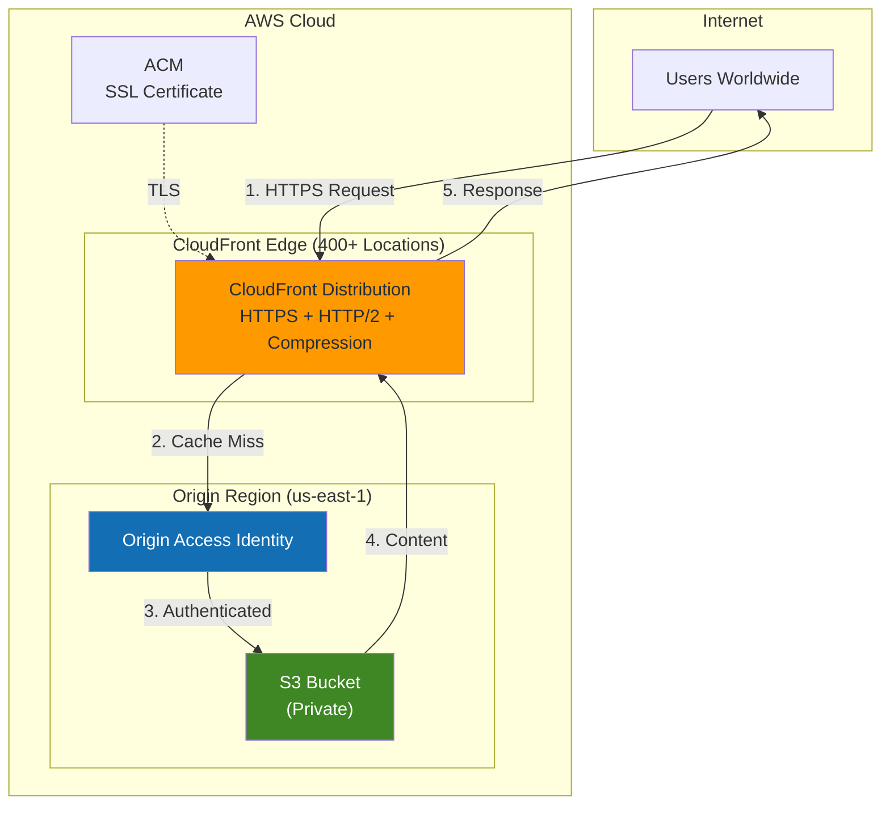

# How to Host a Static Website on AWS S3 with CloudFront CDN

[](https://aws.amazon.com/s3/)
[](https://aws.amazon.com/s3/)
[](https://aws.amazon.com/cloudfront/)
[]()
[]()

> **Architecting on AWS** - Hands-on Lab Series
> **Level:** Beginner | **Time:** 30 minutes | **Cost:** ~$0.02-0.05/month

---

Deploy a serverless, secure, and globally distributed static website on AWS. This lab teaches you how to leverage S3 for storage and CloudFront CDN for global delivery with Origin Access Identity (OAI) for security.

---

## What We're Building

A production-ready static website hosted on **Amazon S3** with **CloudFront CDN** for global delivery and **Origin Access Identity (OAI)** for security.

### Key Features
- **Serverless** - No servers to manage or patch
- **Secure** - HTTPS only, private S3 bucket
- **Fast** - Global CDN with 400+ edge locations
- **Cost-effective** - ~$0.02-0.05/month for low traffic sites

### Use Cases
- Portfolio websites
- Documentation sites
- Landing pages
- Single-page applications (SPAs)
- Game hosting (like our 2048 demo)

---

> **Advanced Users**: Prefer Infrastructure as Code? Deploy this architecture using Terraform for version-controlled, reproducible deployments. **[Continue with Terraform →](./terraform/README.md)**

---

## Architecture



### Request Flow

```
User → CloudFront Edge → [Cache Hit?] → Return Cached Content
                              ↓ No
                         OAI Auth → S3 Bucket → Cache & Return
```

### Components

| Component | Purpose |
|-----------|---------|
| **S3 Bucket** | Stores website files (HTML, CSS, JS) |
| **CloudFront** | CDN - caches content at edge locations |
| **OAI** | Secure bridge between CloudFront and S3 |
| **ACM** | Provides free SSL/TLS certificate |

---

## Implementation

### Prerequisites

```bash
# Required
aws --version  # AWS CLI v2
jq --version   # JSON processor

# Verify AWS credentials
aws sts get-caller-identity
```

### Step 1: Create Private S3 Bucket

```bash
# Set variables
BUCKET_NAME="my-static-site-$(date +%s)"
REGION="us-east-1"

# Create bucket
aws s3api create-bucket \
    --bucket "$BUCKET_NAME" \
    --region "$REGION"

# Block ALL public access
aws s3api put-public-access-block \
    --bucket "$BUCKET_NAME" \
    --public-access-block-configuration \
    "BlockPublicAcls=true,IgnorePublicAcls=true,BlockPublicPolicy=true,RestrictPublicBuckets=true"
```

### Step 2: Create Origin Access Identity

```bash
# Create OAI
OAI_RESULT=$(aws cloudfront create-cloud-front-origin-access-identity \
    --cloud-front-origin-access-identity-config \
    "CallerReference=$(date +%s),Comment=OAI-$BUCKET_NAME")

# Extract values
OAI_ID=$(echo "$OAI_RESULT" | jq -r '.CloudFrontOriginAccessIdentity.Id')
OAI_CANONICAL=$(echo "$OAI_RESULT" | jq -r '.CloudFrontOriginAccessIdentity.S3CanonicalUserId')

echo "OAI ID: $OAI_ID"
```

### Step 3: Configure Bucket Policy

```bash
# Allow only CloudFront OAI to access bucket
cat > /tmp/policy.json << EOF
{
    "Version": "2012-10-17",
    "Statement": [{
        "Effect": "Allow",
        "Principal": {"CanonicalUser": "$OAI_CANONICAL"},
        "Action": "s3:GetObject",
        "Resource": "arn:aws:s3:::$BUCKET_NAME/*"
    }]
}
EOF

aws s3api put-bucket-policy --bucket "$BUCKET_NAME" --policy file:///tmp/policy.json
```

### Step 4: Upload Website Files

```bash
# Upload files
aws s3 sync ./website/ "s3://$BUCKET_NAME/"

# Set content types (important for proper rendering)
aws s3 cp "s3://$BUCKET_NAME/" "s3://$BUCKET_NAME/" --recursive \
    --exclude "*" --include "*.html" \
    --content-type "text/html" --metadata-directive REPLACE

aws s3 cp "s3://$BUCKET_NAME/" "s3://$BUCKET_NAME/" --recursive \
    --exclude "*" --include "*.css" \
    --content-type "text/css" --metadata-directive REPLACE

aws s3 cp "s3://$BUCKET_NAME/" "s3://$BUCKET_NAME/" --recursive \
    --exclude "*" --include "*.js" \
    --content-type "application/javascript" --metadata-directive REPLACE
```

### Step 5: Create CloudFront Distribution

```bash
cat > /tmp/cf-config.json << EOF
{
    "CallerReference": "$(date +%s)",
    "Comment": "Static website CDN",
    "DefaultCacheBehavior": {
        "TargetOriginId": "S3-$BUCKET_NAME",
        "ViewerProtocolPolicy": "redirect-to-https",
        "Compress": true,
        "AllowedMethods": {"Quantity": 2, "Items": ["GET", "HEAD"],
            "CachedMethods": {"Quantity": 2, "Items": ["GET", "HEAD"]}},
        "ForwardedValues": {"QueryString": false, "Cookies": {"Forward": "none"}},
        "MinTTL": 0, "DefaultTTL": 86400, "MaxTTL": 31536000,
        "TrustedSigners": {"Enabled": false, "Quantity": 0}
    },
    "Origins": {"Quantity": 1, "Items": [{
        "Id": "S3-$BUCKET_NAME",
        "DomainName": "$BUCKET_NAME.s3.$REGION.amazonaws.com",
        "S3OriginConfig": {"OriginAccessIdentity": "origin-access-identity/cloudfront/$OAI_ID"}
    }]},
    "Enabled": true,
    "DefaultRootObject": "index.html",
    "PriceClass": "PriceClass_100",
    "HttpVersion": "http2"
}
EOF

CF_RESULT=$(aws cloudfront create-distribution --distribution-config file:///tmp/cf-config.json)
CF_DOMAIN=$(echo "$CF_RESULT" | jq -r '.Distribution.DomainName')
CF_ID=$(echo "$CF_RESULT" | jq -r '.Distribution.Id')

echo "Website URL: https://$CF_DOMAIN"
echo "Distribution ID: $CF_ID"
```

### Step 6: Wait for Deployment

```bash
# Check status (takes 10-15 minutes)
aws cloudfront get-distribution --id "$CF_ID" --query 'Distribution.Status'

# When status is "Deployed", your site is live!
```

---

## AWS Best Practices

### Security (Well-Architected)

| Practice | Implementation | Why |
|----------|----------------|-----|
| **Block Public Access** | All 4 settings enabled on S3 | Prevents accidental exposure |
| **Origin Access Identity** | CloudFront-only access to S3 | Defense in depth |
| **HTTPS Enforcement** | `redirect-to-https` policy | Data encryption in transit |
| **TLS 1.2+** | CloudFront default | Modern encryption |
| **Least Privilege** | Bucket policy allows only OAI | Minimal permissions |

### Performance

| Practice | Implementation | Benefit |
|----------|----------------|---------|
| **Edge Caching** | 24h default TTL | Reduced latency |
| **HTTP/2** | Enabled | Multiplexed connections |
| **Compression** | Gzip enabled | 70% smaller payloads |
| **PriceClass_100** | NA + Europe edges | Cost-optimized caching |

### Cost Optimization

| Practice | Implementation | Savings |
|----------|----------------|---------|
| **No idle costs** | Serverless architecture | Pay only for usage |
| **Regional origin** | Single S3 region | No cross-region transfer |
| **Aggressive caching** | Long TTLs | Fewer origin requests |
| **Right-sized price class** | PriceClass_100 | Lower edge costs |

---

## Pricing Breakdown

### AWS Pricing (us-east-1, January 2026)

#### Amazon S3

| Component | Rate | Usage | Monthly Cost |
|-----------|------|-------|--------------|
| Storage (Standard) | $0.023/GB | 0.001 GB | $0.00002 |
| PUT requests | $0.005/1,000 | 10 | $0.00005 |
| GET requests | $0.0004/1,000 | 10,000 | $0.004 |
| **S3 Total** | | | **$0.004** |

#### Amazon CloudFront

| Component | Rate | Usage | Monthly Cost |
|-----------|------|-------|--------------|
| Data Transfer (first 10TB) | $0.085/GB | 1 GB | $0.085 |
| HTTPS Requests (first 10M) | $0.01/10,000 | 100,000 | $0.10 |
| **CloudFront Total** | | | **$0.185** |

#### Free Components

| Component | Cost |
|-----------|------|
| Origin Access Identity | FREE |
| ACM SSL Certificate | FREE |
| CloudFront SSL | FREE |

### Total Monthly Cost

| Traffic Level | Estimated Cost |
|---------------|----------------|
| **Low** (1K visits) | ~$0.02 |
| **Medium** (10K visits) | ~$0.20 |
| **High** (100K visits) | ~$2.00 |

> **AWS Free Tier**: 50GB CloudFront transfer + 2M requests/month for 12 months

---

## Cleanup

### Delete All Resources

```bash
# 1. Disable CloudFront (required before deletion)
ETAG=$(aws cloudfront get-distribution-config --id "$CF_ID" --query 'ETag' --output text)
aws cloudfront get-distribution-config --id "$CF_ID" --query 'DistributionConfig' > /tmp/cf.json
# Edit /tmp/cf.json: set "Enabled": false
aws cloudfront update-distribution --id "$CF_ID" --if-match "$ETAG" \
    --distribution-config file:///tmp/cf-disabled.json

# 2. Wait for CloudFront to disable (5-10 minutes)
watch -n 30 "aws cloudfront get-distribution --id $CF_ID --query 'Distribution.Status'"

# 3. Delete CloudFront distribution
ETAG=$(aws cloudfront get-distribution --id "$CF_ID" --query 'ETag' --output text)
aws cloudfront delete-distribution --id "$CF_ID" --if-match "$ETAG"

# 4. Delete OAI
OAI_ETAG=$(aws cloudfront get-cloud-front-origin-access-identity --id "$OAI_ID" --query 'ETag' --output text)
aws cloudfront delete-cloud-front-origin-access-identity --id "$OAI_ID" --if-match "$OAI_ETAG"

# 5. Empty and delete S3 bucket
aws s3 rm "s3://$BUCKET_NAME" --recursive
aws s3api delete-bucket --bucket "$BUCKET_NAME"

echo "All resources deleted!"
```

### Quick Cleanup Script

```bash
#!/bin/bash
# cleanup.sh - Delete all resources
# Usage: ./cleanup.sh <bucket-name> <cf-distribution-id> <oai-id>

BUCKET=$1; CF_ID=$2; OAI_ID=$3

aws s3 rm "s3://$BUCKET" --recursive
aws s3api delete-bucket --bucket "$BUCKET"
# Note: CloudFront must be disabled first (manual step)
```

---

## Quick Reference

### Files Structure

```
website/
├── index.html      # Main page
├── error.html      # 404 error page
├── css/
│   └── style.css   # Styles
└── js/
    └── main.js     # Scripts
```

### Key Commands

```bash
# Check distribution status
aws cloudfront get-distribution --id $CF_ID --query 'Distribution.Status'

# Invalidate cache (after updates)
aws cloudfront create-invalidation --distribution-id $CF_ID --paths "/*"

# View S3 bucket contents
aws s3 ls s3://$BUCKET_NAME/

# Sync local changes
aws s3 sync ./website/ s3://$BUCKET_NAME/
```

### Troubleshooting

| Issue | Solution |
|-------|----------|
| 403 Forbidden | Check bucket policy has correct OAI |
| Site not updating | Create CloudFront invalidation |
| Mixed content warnings | Ensure all assets use HTTPS |
| Slow first load | Normal - edge cache is cold |

---

## Summary

| What | Details |
|------|---------|
| **Architecture** | S3 + CloudFront + OAI |
| **Security** | Private bucket, HTTPS only, OAI |
| **Performance** | Global CDN, HTTP/2, compression |
| **Cost** | ~$0.02-0.20/month |
| **Deployment Time** | ~15 minutes |

---

---

**Don't just read—build.** Deploy this lab, experiment with cache invalidation, test different TTL configurations, and develop a practical understanding of serverless static hosting that powers millions of production websites.

---

## License

MIT License - Free to use for learning and commercial projects.

---

Created by **[Shashank Chinchli](https://www.linkedin.com/in/shashankk/)**, an AWS Solutions Architect and Golden Jacket Holder, as part of the *Architecting on AWS Hands-on Labs Series*.

**Last Updated**: January 2026
