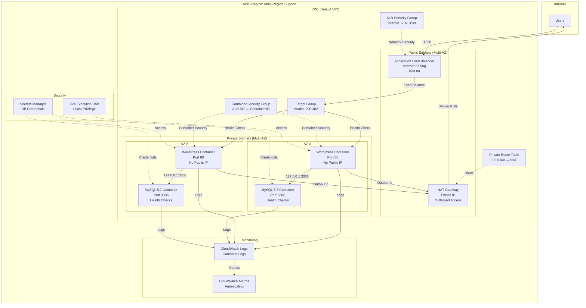

# Architecture Diagram

## Overview
Production-ready WordPress on ECS Fargate with private subnets, NAT Gateway, and Application Load Balancer.

## Architecture



## Key Components

### ECS Fargate
- Serverless container orchestration
- WordPress + MySQL containers
- No EC2 instances to manage
- Auto-scaling based on CPU/memory

### Private Subnets
- Containers have NO public IP addresses
- Enhanced security posture
- All outbound traffic through NAT Gateway

### Application Load Balancer
- Internet-facing in public subnets
- Distributes traffic across AZs
- Health checks (200, 302 responses)
- Target group management

### NAT Gateway
- Enables outbound internet access
- Required for Docker image pulls
- Elastic IP for consistent outbound IP
- High availability

### Security Groups
- **ALB Security Group**: Internet → ALB:80
- **Container Security Group**: ALB SG → Container:80
- Zero trust network model

## Security Features

- ✅ Private Subnet Architecture (no public IPs)
- ✅ Dedicated Security Groups (ALB + Container)
- ✅ Least Privilege IAM Roles
- ✅ NAT Gateway (controlled outbound)
- ✅ Multi-AZ Deployment
- ✅ CloudWatch Logging
- ⚠️ HTTP only (HTTPS recommended for production)

## Deployment

```bash
# Deploy to us-east-1 with 'prod' environment
./deploy-multi-region.sh us-east-1 prod

# Validate deployment
./validate-deployment.sh us-east-1

# Access WordPress
http://YOUR_ALB_DNS_NAME/wp-admin/install.php
```

## Cost Breakdown

| Service | Monthly Cost |
|---------|--------------|
| ECS Fargate (2 tasks) | ~$15-20 |
| NAT Gateway | ~$32 |
| Application Load Balancer | ~$16 |
| CloudWatch Logs | ~$5 |
| **Total** | **~$68-73** |

### Cost Optimization
- Use Fargate Spot for dev/test (70% savings)
- Single NAT Gateway for non-production
- Reduce log retention period
- Right-size container resources

## High Availability

- **Multi-AZ**: Tasks across 2 availability zones
- **Auto-scaling**: Based on CPU/memory metrics
- **Health Checks**: Automated failover
- **Load Balancing**: Even traffic distribution

## Duration
**45 minutes**
