# Deploying WordPress CMS on AWS ECS

[](https://aws.amazon.com/ecs/)
[](https://aws.amazon.com/fargate/)
[](https://aws.amazon.com/elasticloadbalancing/)
[]()
[]()

> **Architecting on AWS** - Hands-on Lab Series
> **Level:** Intermediate | **Time:** 45 minutes | **Cost:** ~$30-50/month

---

Production-ready WordPress deployment on AWS ECS Fargate with enterprise-grade security features including private subnets, dedicated security groups, and NAT Gateway for controlled internet access.

---

## Architecture Overview

This project demonstrates deploying a secure WordPress application on AWS ECS Fargate with enterprise-grade security features including private subnets, dedicated security groups, and NAT Gateway for controlled internet access.

```mermaid
graph TB
    subgraph "Internet"
        U[Users]
    end
    
    subgraph "AWS Region: Multi-Region Support"
        subgraph "VPC: Default VPC (172.31.0.0/16)"
            subgraph "Public Subnets (Multi-AZ)"
                ALB[Application Load Balancer<br/>Internet-Facing<br/>Port 80<br/>Dedicated Security Group]
                NAT[NAT Gateway<br/>Elastic IP<br/>Outbound Internet Access]
            end
            
            subgraph "Private Subnets (Multi-AZ)"
                subgraph "AZ-A: Dynamic CIDR"
                    subgraph "ECS Fargate Cluster"
                        subgraph "WordPress Task"
                            WP1[WordPress Container<br/>Port 80<br/>No Public IP<br/>Auto-scaling Ready]
                            DB1[MySQL 5.7 Container<br/>Port 3306<br/>Health Checks<br/>Persistent Storage]
                        end
                    end
                end
                
                subgraph "AZ-B: Dynamic CIDR"
                    subgraph "ECS Fargate Cluster"
                        subgraph "WordPress Task"
                            WP2[WordPress Container<br/>Port 80<br/>No Public IP<br/>Auto-scaling Ready]
                            DB2[MySQL 5.7 Container<br/>Port 3306<br/>Health Checks<br/>Persistent Storage]
                        end
                    end
                end
            end
            
            ALBSG[ALB Security Group<br/>Internet → ALB:80<br/>Least Privilege]
            APPSG[Container Security Group<br/>ALB SG → Container:80<br/>Zero Trust Model]
            TG[Target Group<br/>Health Check: 200,302<br/>Automated Failover]
            RT[Private Route Table<br/>0.0.0.0/0 → NAT Gateway<br/>Controlled Internet Access]
        end
        
        subgraph "Monitoring & Logging"
            CW[CloudWatch Logs<br/>Container Logs<br/>Application Metrics]
            CWA[CloudWatch Alarms<br/>Health Monitoring<br/>Auto-scaling Triggers]
        end
        
        subgraph "Security & Access"
            IAM[IAM Execution Role<br/>Least Privilege<br/>Task Permissions]
            SM[Secrets Manager<br/>Database Credentials<br/>Secure Storage]
        end
        
        subgraph "Deployment Automation"
            DS[Deploy Script<br/>Multi-Region Support<br/>Environment Isolation]
            VS[Validation Script<br/>Health Checks<br/>Automated Testing]
        end
    end
    
    U -->|HTTP/HTTPS| ALB
    ALB -->|Load Balance| TG
    TG -->|Health Checks| WP1
    TG -->|Health Checks| WP2
    WP1 -->|127.0.0.1:3306| DB1
    WP2 -->|127.0.0.1:3306| DB2
    WP1 -->|Controlled Access| NAT
    WP2 -->|Controlled Access| NAT
    NAT -->|Docker Pulls/Updates| U
    WP1 -->|Application Logs| CW
    WP2 -->|Application Logs| CW
    DB1 -->|Database Logs| CW
    DB2 -->|Database Logs| CW
    CW -->|Metrics| CWA
    ALBSG -.->|Network Security| ALB
    APPSG -.->|Container Security| WP1
    APPSG -.->|Container Security| WP2
    RT -.->|Route Management| NAT
    IAM -.->|Access Control| WP1
    IAM -.->|Access Control| WP2
    SM -.->|Secure Credentials| DB1
    SM -.->|Secure Credentials| DB2
    DS -.->|Automated Deployment| ALB
    VS -.->|Health Validation| TG
    
    classDef aws fill:#FF9900,stroke:#232F3E,stroke-width:2px,color:#fff
    classDef security fill:#FF4B4B,stroke:#232F3E,stroke-width:2px,color:#fff
    classDef container fill:#4B9AFF,stroke:#232F3E,stroke-width:2px,color:#fff
    classDef network fill:#9D5AAE,stroke:#232F3E,stroke-width:2px,color:#fff
    classDef automation fill:#00C853,stroke:#232F3E,stroke-width:2px,color:#fff
    
    class ALB,TG,CW,IAM,NAT aws
    class ALBSG,APPSG,SM security
    class WP1,WP2,DB1,DB2 container
    class RT,CWA network
    class DS,VS automation
```



## 🎓 Learning Resources

### New to AWS ECS?
**📚 Complete Learning Guide Available**: `AWS_ECS_LEARNING_GUIDE.md`

This comprehensive guide covers:
- **AWS Fundamentals**: Cloud computing basics and core services
- **Container Concepts**: Docker, images, and containerization
- **ECS Deep Dive**: Clusters, services, tasks, and Fargate
- **Networking Essentials**: VPC, subnets, security groups, load balancers
- **Security Fundamentals**: IAM, encryption, best practices
- **Hands-on Tutorial**: Step-by-step deployment walkthrough
- **Troubleshooting**: Common issues and debugging techniques

**Perfect for beginners** - No prior AWS experience required!

## 🚀 Quick Start

### Prerequisites
- AWS CLI configured with appropriate permissions
- Basic understanding of AWS services

### 1. Clone Repository
```bash
git clone https://github.com/schinchli/ArchitectingonAWS.git
cd ArchitectingonAWS/wordpress-ecs-private-subnets
```

### 2. Automated Deployment
```bash
# Deploy to us-east-1 with 'prod' environment
./deploy-multi-region.sh us-east-1 prod

# Deploy to us-west-1 with 'dev' environment
./deploy-multi-region.sh us-west-1 dev
```

### 3. Validate Deployment
```bash
# Run validation tests
./validate-deployment.sh us-east-1

# Manual test
curl -I http://YOUR_ALB_DNS_NAME
```

### 4. Access WordPress
After deployment completes (5-10 minutes):
- **Installation**: `http://YOUR_ALB_DNS_NAME/wp-admin/install.php`
- **Website**: `http://YOUR_ALB_DNS_NAME`

## 📋 Infrastructure Components

### Core Services
- **ECS Cluster**: Fargate-based container orchestration in private subnets
- **Task Definition**: WordPress + MySQL containers with health checks
- **Application Load Balancer**: Multi-AZ load balancing in public subnets
- **NAT Gateway**: Controlled internet access for private subnet containers
- **Private Subnets**: Isolated container environment with dynamic CIDR allocation
- **Security Groups**: Dedicated groups for ALB and containers

### Automation & Deployment
- **Multi-Region Deployment Script**: Automated infrastructure provisioning
- **Validation Script**: Health checks and deployment verification
- **Environment Isolation**: Support for dev, staging, prod environments
- **Dynamic Configuration**: Region-agnostic deployment capability

### Security Features
- ✅ **Private Subnet Architecture**: Containers have no public IP addresses
- ✅ **Dedicated Security Groups**: Separate groups for ALB and containers
- ✅ **Least Privilege Access**: Container access only from ALB security group
- ✅ **NAT Gateway**: Controlled outbound internet access for updates
- ✅ **Multi-AZ Deployment**: High availability across availability zones
- ✅ **Network Isolation**: Defense in depth with multiple security layers
- ✅ **Zero Trust Model**: No implicit trust between network segments
- ⚠️ **Security Audit**: Comprehensive AWS Well-Architected review completed

### Security Audit Results
**Current Security Score: B+ (Good with room for improvement)**

**Critical Improvements Needed:**
- 🔴 **HTTPS/TLS Encryption**: Currently HTTP only
- 🔴 **Database Security**: Credentials need Secrets Manager
- 🔴 **Data Encryption**: Enable encryption at rest and in transit
- 🟡 **Threat Detection**: GuardDuty and CloudTrail recommended
- 🟡 **WAF Protection**: Application firewall needed

**Security Enhancement Available:**
```bash
# Run comprehensive security enhancements
./security-enhancements.sh us-east-1 prod

# View detailed security audit
cat SECURITY_AUDIT.md
```

## 🛠️ Deployment Guide

### Step 1: Create ECS Cluster
```bash
aws ecs create-cluster --cluster-name wordpress-cluster --region us-east-1
```

### Step 2: Create Private Subnets
```bash
# Get your default VPC ID
VPC_ID=$(aws ec2 describe-vpcs --filters "Name=is-default,Values=true" --query "Vpcs[0].VpcId" --output text --region us-east-1)

# Create private subnets
aws ec2 create-subnet \
  --YOUR_VPC_ID $VPC_ID \
  --cidr-block 172.31.96.0/20 \
  --availability-zone us-east-1a \
  --region us-east-1

aws ec2 create-subnet \
  --YOUR_VPC_ID $VPC_ID \
  --cidr-block 172.31.112.0/20 \
  --availability-zone us-east-1b \
  --region us-east-1
```

### Step 3: Create NAT Gateway
```bash
# Get public subnet ID
PUBLIC_SUBNET_ID=$(aws ec2 describe-subnets --filters "Name=YOUR_VPC_ID,Values=$VPC_ID" "Name=map-public-ip-on-launch,Values=true" --query "Subnets[0].SubnetId" --output text --region us-east-1)

# Allocate Elastic IP
aws ec2 allocate-address --domain vpc --region us-east-1

# Create NAT Gateway (replace EIP_ALLOC_ID with your allocation ID)
aws ec2 create-YOUR_NAT_GATEWAY_ID \
  --YOUR_SUBNET_ID $PUBLIC_SUBNET_ID \
  --allocation-id $EIP_ALLOC_ID \
  --region us-east-1
```

### Step 4: Configure Route Table
```bash
# Create private route table
aws ec2 create-route-table --YOUR_VPC_ID $VPC_ID --region us-east-1

# Add route to NAT Gateway (replace NAT_GATEWAY_ID and ROUTE_TABLE_ID)
aws ec2 create-route \
  --route-table-id $ROUTE_TABLE_ID \
  --destination-cidr-block 0.0.0.0/0 \
  --YOUR_NAT_GATEWAY_ID-id $NAT_GATEWAY_ID \
  --region us-east-1

# Associate private subnets with route table
aws ec2 associate-route-table \
  --YOUR_SUBNET_ID $PRIVATE_SUBNET_1_ID \
  --route-table-id $ROUTE_TABLE_ID \
  --region us-east-1

aws ec2 associate-route-table \
  --YOUR_SUBNET_ID $PRIVATE_SUBNET_2_ID \
  --route-table-id $ROUTE_TABLE_ID \
  --region us-east-1
```

### Step 5: Create Security Groups
```bash
# Create ALB security group
aws ec2 create-security-group \
  --group-name wordpress-alb-sg \
  --description "Security group for WordPress ALB" \
  --YOUR_VPC_ID $VPC_ID \
  --region us-east-1

# Create container security group
aws ec2 create-security-group \
  --group-name wordpress-container-sg \
  --description "Security group for WordPress containers" \
  --YOUR_VPC_ID $VPC_ID \
  --region us-east-1

# Allow HTTP access to ALB from internet
aws ec2 authorize-security-group-ingress \
  --group-id $ALB_SG_ID \
  --protocol tcp \
  --port 80 \
  --cidr 0.0.0.0/0 \
  --region us-east-1

# Allow container access only from ALB security group
aws ec2 authorize-security-group-ingress \
  --group-id $CONTAINER_SG_ID \
  --protocol tcp \
  --port 80 \
  --source-group $ALB_SG_ID \
  --region us-east-1
```

### Step 6: Create IAM Role
```bash
# Create trust policy file
cat > trust-policy.json << EOF
{
  "Version": "2012-10-17",
  "Statement": [
    {
      "Effect": "Allow",
      "Principal": {
        "Service": "ecs-tasks.amazonaws.com"
      },
      "Action": "sts:AssumeRole"
    }
  ]
}
EOF

# Create IAM role
aws iam create-role \
  --role-name ecsTaskExecutionRole \
  --assume-role-policy-document file://trust-policy.json \
  --region us-east-1

# Attach policy
aws iam attach-role-policy \
  --role-name ecsTaskExecutionRole \
  --policy-arn arn:aws:iam::aws:policy/service-role/AmazonECSTaskExecutionRolePolicy \
  --region us-east-1
```

### Step 7: Create CloudWatch Log Group
```bash
aws logs create-log-group --log-group-name /ecs/wordpress --region us-east-1
```

### Step 8: Register Task Definition
Use the provided `wordpress-task-definition.json` file:
```bash
aws ecs register-task-definition \
  --cli-input-json file://wordpress-task-definition.json \
  --region us-east-1
```

### Step 9: Create Application Load Balancer
```bash
# Get public subnet IDs
PUBLIC_SUBNET_IDS=$(aws ec2 describe-subnets --filters "Name=YOUR_VPC_ID,Values=$VPC_ID" "Name=map-public-ip-on-launch,Values=true" --query "Subnets[].SubnetId" --output text --region us-east-1)

# Create ALB in public subnets
aws elbv2 create-load-balancer \
  --name wordpress-alb \
  --subnets $PUBLIC_SUBNET_IDS \
  --security-groups $ALB_SG_ID \
  --region us-east-1
```

### Step 10: Create Target Group
```bash
aws elbv2 create-target-group \
  --name wordpress-tg \
  --protocol HTTP \
  --port 80 \
  --YOUR_VPC_ID $VPC_ID \
  --target-type ip \
  --health-check-path / \
  --matcher HttpCode=200,302 \
  --health-check-interval-seconds 10 \
  --health-check-timeout-seconds 2 \
  --healthy-threshold-count 2 \
  --region us-east-1
```

### Step 11: Create ECS Service
```bash
# Get private subnet IDs
PRIVATE_SUBNET_IDS=$(aws ec2 describe-subnets --filters "Name=YOUR_VPC_ID,Values=$VPC_ID" "Name=cidr-block,Values=172.31.96.0/20,172.31.112.0/20" --query "Subnets[].SubnetId" --output text --region us-east-1)

# Create service in private subnets
aws ecs create-service \
  --cluster wordpress-cluster \
  --service-name wordpress-service \
  --task-definition wordpress-task:1 \
  --desired-count 1 \
  --launch-type FARGATE \
  --network-configuration "awsvpcConfiguration={subnets=[$PRIVATE_SUBNET_IDS],securityGroups=[$CONTAINER_SG_ID],assignPublicIp=DISABLED}" \
  --load-balancers targetGroupArn=$TARGET_GROUP_ARN,containerName=wordpress,containerPort=80 \
  --region us-east-1
```

## 📁 Configuration Files

All configuration files and deployment scripts are provided in this repository:

### Deployment Scripts
- `deploy-multi-region.sh` - Automated multi-region deployment script
- `validate-deployment.sh` - Deployment validation and health checks
- `DEPLOYMENT_GUIDE.md` - Comprehensive deployment documentation

### Configuration Files
- `wordpress-task-definition.json` - ECS task definition with WordPress and MySQL
- `trust-policy.json` - IAM role trust policy
- `cloudfront-config.json` - CloudFront distribution configuration (optional)
- `waf-config.json` - WAF configuration with security rules (optional)

### Usage Examples
```bash
# Deploy production environment to us-east-1
./deploy-multi-region.sh us-east-1 prod

# Deploy development environment to us-west-2
./deploy-multi-region.sh us-west-2 dev

# Validate any deployment
./validate-deployment.sh us-east-1
```

## 🔒 Security Best Practices

### Current Implementation
1. **Network Security**: Private subnets with no public IP addresses for containers
2. **Access Control**: Dedicated security groups with least privilege access
3. **Internet Access**: Controlled outbound access through NAT Gateway
4. **Defense in Depth**: Multiple security layers (ALB → Security Groups → Private Subnets)
5. **Monitoring**: CloudWatch logs for all components
6. **High Availability**: Multi-AZ deployment for resilience

### AWS Well-Architected Security Audit
A comprehensive security audit has been conducted following AWS Well-Architected Framework principles:

**Security Score: B+ (37/60 points)**

**Critical Security Gaps Identified:**
- ❌ No HTTPS/TLS encryption (HTTP only)
- ❌ Database credentials in plain text
- ❌ No data encryption at rest
- ❌ Missing threat detection (GuardDuty)
- ❌ No API logging (CloudTrail)
- ❌ No WAF protection

### Security Enhancement Script
Run the automated security enhancement script to address critical gaps:

```bash
# Apply AWS Well-Architected security improvements
./security-enhancements.sh us-east-1 prod

# This will implement:
# - CloudTrail API logging
# - GuardDuty threat detection  
# - KMS encryption keys
# - Secrets Manager for credentials
# - WAF with OWASP rules
# - Enhanced IAM policies
# - Security monitoring alarms
```

### Production Security Recommendations
1. **HTTPS/TLS**: Add SSL certificate and redirect HTTP to HTTPS
2. **WAF Integration**: Deploy AWS WAF for application-layer protection
3. **Database Security**: Migrate to RDS with encryption at rest
4. **Secrets Management**: Use AWS Secrets Manager for all credentials
5. **VPC Flow Logs**: Enable for network traffic monitoring
6. **CloudTrail**: Enable for comprehensive API call auditing
7. **Container Scanning**: Use ECR image scanning for vulnerabilities
8. **Incident Response**: Implement automated security response procedures

### Compliance Considerations
- **SOC 2**: Requires encryption and comprehensive monitoring
- **PCI DSS**: Not currently compliant due to encryption gaps
- **GDPR**: Data protection requirements need encryption at rest
- **HIPAA**: Additional security controls required for healthcare data

### Security Monitoring
After implementing security enhancements, monitor:
- CloudWatch security alarms
- GuardDuty findings
- Security Hub compliance status
- WAF blocked requests
- VPC Flow Logs anomalies

## 🎯 Access Your WordPress

After deployment completes (5-10 minutes):

1. **WordPress Installation**: `http://YOUR_ALB_DNS_NAME/wp-admin/install.php`
2. **Website**: `http://YOUR_ALB_DNS_NAME`

**Note**: The ALB DNS name will be provided after ALB creation. Containers are in private subnets for enhanced security.

## 💰 Cost Optimization

- **Fargate Spot**: Consider for non-production workloads
- **Auto Scaling**: Configure based on CPU/memory utilization
- **Reserved Capacity**: For predictable workloads
- **CloudFront Caching**: Reduces origin load and costs

## 🔧 Troubleshooting

### Common Issues
1. **502/504 Errors**: Check target group health, security group rules, NAT Gateway connectivity
2. **Database Connection**: Verify container networking (127.0.0.1:3306)
3. **Container Startup Issues**: Check NAT Gateway for Docker image pulls
4. **Health Check Failures**: Verify health check accepts 200,302 responses
5. **Internet Access**: Ensure NAT Gateway route is configured correctly

### Monitoring Commands
```bash
# Check ECS service status
aws ecs describe-services --cluster wordpress-cluster --services wordpress-service --region us-east-1

# Check target health
aws elbv2 describe-target-health --target-group-arn $TARGET_GROUP_ARN --region us-east-1

# Check NAT Gateway status
aws ec2 describe-YOUR_NAT_GATEWAY_ID --region us-east-1

# Check route table configuration
aws ec2 describe-route-tables --region us-east-1
```

## 📚 Additional Resources

- [AWS ECS Documentation](https://docs.aws.amazon.com/ecs/)
- [AWS CloudFront Documentation](https://docs.aws.amazon.com/cloudfront/)
- [AWS WAF Documentation](https://docs.aws.amazon.com/waf/)

---

**Don't just read—build.** Deploy this lab, experiment with container scaling, test failover scenarios, and develop a practical understanding of containerized deployments that power modern enterprise applications.

---

## License

MIT License - Free to use for learning and commercial projects.

---

Created by **[Shashank Chinchli](https://www.linkedin.com/in/shashankk/)**, an AWS Solutions Architect and Golden Jacket Holder, as part of the *Architecting on AWS Hands-on Labs Series*.

**Note**: This configuration is for demonstration purposes. For production use, implement additional security measures, monitoring, and backup strategies as outlined in the security best practices section.
