# WordPress on AWS ECS with WAF Protection

> **Production-ready WordPress deployment on AWS ECS Fargate with comprehensive security**

## 🏗️ Architecture Overview

This project demonstrates deploying a scalable WordPress application on AWS ECS Fargate with enterprise-grade security features.

```mermaid
graph TB
    subgraph "Internet"
        U[Users]
    end
    
    subgraph "AWS Global Edge Network"
        CF[CloudFront Distribution<br/>HTTPS Only<br/>Global CDN]
        WAF[WAF Web ACL<br/>• Common Rule Set<br/>• Known Bad Inputs<br/>• Rate Limiting: 2000/5min]
    end
    
    subgraph "AWS Region: us-east-1"
        subgraph "VPC: Default VPC"
            subgraph "Public Subnets (Multi-AZ)"
                ALB[Application Load Balancer<br/>CloudFront-Only Access<br/>Port 80]
                
                subgraph "ECS Cluster: Fargate"
                    subgraph "Task Definition"
                        WP[WordPress Container<br/>Port 80<br/>CPU: 512, Memory: 1024MB]
                        DB[MySQL 5.7 Container<br/>Port 3306<br/>Health Check Enabled]
                    end
                end
            end
            
            SG[Security Group<br/>CloudFront Prefix List Only<br/>+ ALB Health Checks]
            TG[Target Group<br/>Health Check: 200,302<br/>10s interval, 2s timeout]
        end
        
        CW[CloudWatch Logs<br/>/ecs/wordpress]
        IAM[IAM Role<br/>ecsTaskExecutionRole]
    end
    
    U -->|HTTPS Only| CF
    CF -->|WAF Filtering| WAF
    WAF -->|Allowed Traffic| ALB
    ALB -->|Load Balance| TG
    TG -->|Health Checks| WP
    WP -->|127.0.0.1:3306| DB
    WP -->|Logs| CW
    DB -->|Logs| CW
    SG -.->|Restricts Access| ALB
    IAM -.->|Execution Role| WP
    
    classDef aws fill:#FF9900,stroke:#232F3E,stroke-width:2px,color:#fff
    classDef security fill:#FF4B4B,stroke:#232F3E,stroke-width:2px,color:#fff
    classDef container fill:#4B9AFF,stroke:#232F3E,stroke-width:2px,color:#fff
    
    class CF,ALB,TG,CW,IAM aws
    class WAF,SG security
    class WP,DB container
```



## 🚀 Quick Start

### Prerequisites
- AWS CLI configured with appropriate permissions
- Basic understanding of AWS services

### 1. Clone Repository
```bash
git clone https://github.com/schinchli/ArchitectingonAWS.git
cd ArchitectingonAWS/wordpress-ecs-amazonq
```

### 2. Deploy Infrastructure
Follow the step-by-step commands in the deployment guide below, or use the provided deployment script.

## 📋 Infrastructure Components

### Core Services
- **ECS Cluster**: Fargate-based container orchestration
- **Task Definition**: WordPress + MySQL containers with health checks
- **Application Load Balancer**: Multi-AZ load balancing with health checks
- **CloudFront Distribution**: Global CDN with HTTPS enforcement
- **WAF**: Web Application Firewall with DDoS protection
- **Security Groups**: CloudFront-only access control

### Security Features
- ✅ **CloudFront-Only Access**: Direct ALB access blocked
- ✅ **WAF Protection**: DDoS, SQL injection, XSS protection
- ✅ **HTTPS Enforcement**: All traffic encrypted
- ✅ **Rate Limiting**: 2000 requests per 5 minutes per IP
- ✅ **Global Edge Protection**: 400+ CloudFront locations
- ✅ **Container Security**: Private networking, health checks

## 🛠️ Deployment Guide

### Step 1: Create ECS Cluster
```bash
aws ecs create-cluster --cluster-name wordpress-cluster --region us-east-1
```

### Step 2: Create Security Group
```bash
# Get your default VPC ID
VPC_ID=$(aws ec2 describe-vpcs --filters "Name=is-default,Values=true" --query "Vpcs[0].VpcId" --output text --region us-east-1)

# Create security group
aws ec2 create-security-group \
  --group-name wordpress-sg \
  --description "Security group for WordPress ECS" \
  --vpc-id $VPC_ID \
  --region us-east-1
```

### Step 3: Create IAM Role
```bash
# Create trust policy file
cat > trust-policy.json << EOF
{
  "Version": "2012-10-17",
  "Statement": [
    {
      "Effect": "Allow",
      "Principal": {
        "Service": "ecs-tasks.amazonaws.com"
      },
      "Action": "sts:AssumeRole"
    }
  ]
}
EOF

# Create IAM role
aws iam create-role \
  --role-name ecsTaskExecutionRole \
  --assume-role-policy-document file://trust-policy.json \
  --region us-east-1

# Attach policy
aws iam attach-role-policy \
  --role-name ecsTaskExecutionRole \
  --policy-arn arn:aws:iam::aws:policy/service-role/AmazonECSTaskExecutionRolePolicy \
  --region us-east-1
```

### Step 4: Create CloudWatch Log Group
```bash
aws logs create-log-group --log-group-name /ecs/wordpress --region us-east-1
```

### Step 5: Register Task Definition
Use the provided `wordpress-task-definition.json` file:
```bash
aws ecs register-task-definition \
  --cli-input-json file://wordpress-task-definition.json \
  --region us-east-1
```

### Step 6: Create Application Load Balancer
```bash
# Get subnet IDs
SUBNET_IDS=$(aws ec2 describe-subnets --filters "Name=vpc-id,Values=$VPC_ID" --query "Subnets[?MapPublicIpOnLaunch==\`true\`].SubnetId" --output text --region us-east-1)

# Create ALB
aws elbv2 create-load-balancer \
  --name wordpress-alb \
  --subnets $SUBNET_IDS \
  --security-groups $SECURITY_GROUP_ID \
  --region us-east-1
```

### Step 7: Create Target Group
```bash
aws elbv2 create-target-group \
  --name wordpress-tg \
  --protocol HTTP \
  --port 80 \
  --vpc-id $VPC_ID \
  --target-type ip \
  --health-check-path / \
  --matcher HttpCode=200,302 \
  --health-check-interval-seconds 10 \
  --health-check-timeout-seconds 2 \
  --healthy-threshold-count 2 \
  --region us-east-1
```

### Step 8: Create ECS Service
```bash
aws ecs create-service \
  --cluster wordpress-cluster \
  --service-name wordpress-service \
  --task-definition wordpress-task:1 \
  --desired-count 1 \
  --launch-type FARGATE \
  --network-configuration "awsvpcConfiguration={subnets=[$SUBNET_IDS],securityGroups=[$SECURITY_GROUP_ID],assignPublicIp=ENABLED}" \
  --load-balancers targetGroupArn=$TARGET_GROUP_ARN,containerName=wordpress,containerPort=80 \
  --region us-east-1
```

### Step 9: Create WAF Web ACL
```bash
aws wafv2 create-web-acl \
  --cli-input-json file://waf-config.json \
  --region us-east-1
```

### Step 10: Create CloudFront Distribution
```bash
aws cloudfront create-distribution \
  --distribution-config file://cloudfront-config.json \
  --region us-east-1
```

### Step 11: Configure Security (CloudFront-Only Access)
```bash
# Get CloudFront prefix list
aws ec2 describe-managed-prefix-lists \
  --filters "Name=prefix-list-name,Values=com.amazonaws.global.cloudfront.origin-facing" \
  --region us-east-1

# Remove public access
aws ec2 revoke-security-group-ingress \
  --group-id $SECURITY_GROUP_ID \
  --protocol tcp \
  --port 80 \
  --cidr 0.0.0.0/0 \
  --region us-east-1

# Allow CloudFront access only
aws ec2 authorize-security-group-ingress \
  --group-id $SECURITY_GROUP_ID \
  --ip-permissions '[{"IpProtocol":"tcp","PrefixListIds":[{"PrefixListId":"pl-3b927c52"}],"FromPort":80,"ToPort":80}]' \
  --region us-east-1

# Allow ALB health checks (replace with your subnet CIDRs)
aws ec2 authorize-security-group-ingress \
  --group-id $SECURITY_GROUP_ID \
  --ip-permissions '[{"IpProtocol":"tcp","FromPort":80,"ToPort":80,"IpRanges":[{"CidrIp":"172.31.16.0/20","Description":"ALB health checks"}]}]' \
  --region us-east-1
```

## 📁 Configuration Files

All configuration files are provided in this repository:

- `wordpress-task-definition.json` - ECS task definition with WordPress and MySQL
- `waf-config.json` - WAF configuration with security rules
- `cloudfront-config.json` - CloudFront distribution configuration
- `trust-policy.json` - IAM role trust policy

## 🔒 Security Best Practices

### Implemented Security Measures
1. **Network Security**: CloudFront-only access, no direct internet access to ALB
2. **Application Security**: WAF with OWASP Top 10 protection
3. **Transport Security**: HTTPS enforcement, TLS 1.2+ only
4. **Access Control**: IAM roles with least privilege
5. **Monitoring**: CloudWatch logs for all components

### Production Recommendations
1. **Custom Domain**: Add ACM certificate for custom domain
2. **Database**: Replace MySQL container with RDS for production
3. **Secrets**: Use AWS Secrets Manager for database credentials
4. **Backup**: Implement automated backup strategy
5. **Monitoring**: Set up CloudWatch alarms and SNS notifications

## 🎯 Access Your WordPress

After deployment completes (15-20 minutes for CloudFront):

1. **WordPress Installation**: `https://YOUR_CLOUDFRONT_DOMAIN/wp-admin/install.php`
2. **Website**: `https://YOUR_CLOUDFRONT_DOMAIN`

**Note**: Direct ALB access is blocked for security. Only CloudFront URL will work.

## 💰 Cost Optimization

- **Fargate Spot**: Consider for non-production workloads
- **Auto Scaling**: Configure based on CPU/memory utilization
- **Reserved Capacity**: For predictable workloads
- **CloudFront Caching**: Reduces origin load and costs

## 🔧 Troubleshooting

### Common Issues
1. **502/504 Errors**: Check target group health, security group rules
2. **Database Connection**: Verify container networking (127.0.0.1:3306)
3. **CloudFront 403**: Ensure WAF rules aren't blocking legitimate traffic
4. **Health Check Failures**: Verify health check accepts 200,302 responses

### Monitoring Commands
```bash
# Check ECS service status
aws ecs describe-services --cluster wordpress-cluster --services wordpress-service --region us-east-1

# Check target health
aws elbv2 describe-target-health --target-group-arn $TARGET_GROUP_ARN --region us-east-1

# Check CloudFront distribution
aws cloudfront get-distribution --id $DISTRIBUTION_ID --region us-east-1
```

## 📚 Additional Resources

- [AWS ECS Documentation](https://docs.aws.amazon.com/ecs/)
- [AWS CloudFront Documentation](https://docs.aws.amazon.com/cloudfront/)
- [AWS WAF Documentation](https://docs.aws.amazon.com/waf/)

## 📄 License

This project is licensed under the MIT License - see the LICENSE file for details.

## 🤝 Contributing

Contributions are welcome! Please feel free to submit a Pull Request.

---

**⚠️ Important**: This configuration is for demonstration purposes. For production use, implement additional security measures, monitoring, and backup strategies as outlined in the security best practices section.
